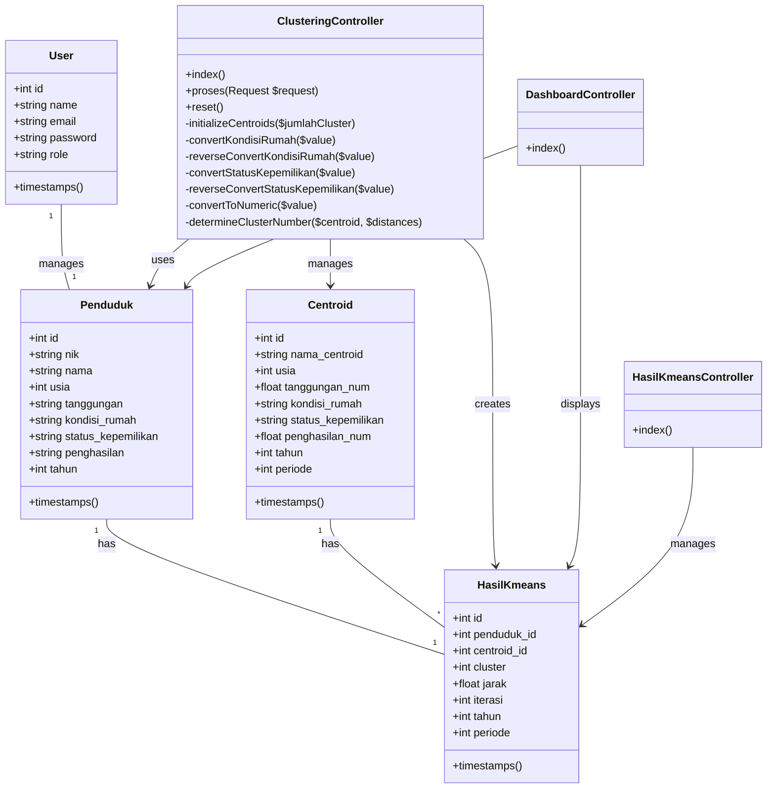

# Class Diagram - K-means Clustering Application

## Class Descriptions

### Models

1. **User**
   - Represents system users (admin)
   - Manages authentication and authorization
   - Attributes: id, name, email, password, role

2. **Penduduk**
   - Represents citizen data
   - Contains demographic and economic information
   - Attributes: id, nik, nama, usia, tanggungan, kondisi_rumah, status_kepemilikan, penghasilan, tahun

3. **Centroid**
   - Represents cluster centers
   - Stores centroid values for each iteration
   - Attributes: id, nama_centroid, usia, tanggungan_num, kondisi_rumah, status_kepemilikan, penghasilan_num, tahun, periode

4. **HasilKmeans**
   - Stores clustering results
   - Links penduduk to their assigned clusters
   - Attributes: id, penduduk_id, centroid_id, cluster, jarak, iterasi, tahun, periode

### Controllers

1. **ClusteringController**
   - Manages the K-means clustering process
   - Methods:
     - index(): Display clustering page
     - proses(): Execute clustering
     - reset(): Clear clustering results
     - Various helper methods for data conversion

2. **DashboardController**
   - Manages dashboard display
   - Methods:
     - index(): Display dashboard with statistics

3. **HasilKmeansController**
   - Manages clustering results
   - Methods:
     - index(): Display clustering results

## Relationships

1. **User-Penduduk**
   - One-to-one relationship
   - User manages penduduk data

2. **Penduduk-HasilKmeans**
   - One-to-one relationship
   - Each penduduk has one clustering result

3. **Centroid-HasilKmeans**
   - One-to-many relationship
   - Each centroid can have multiple results

4. **Controller-Model Relationships**
   - Controllers use models to perform operations
   - Controllers manage data flow and business logic 