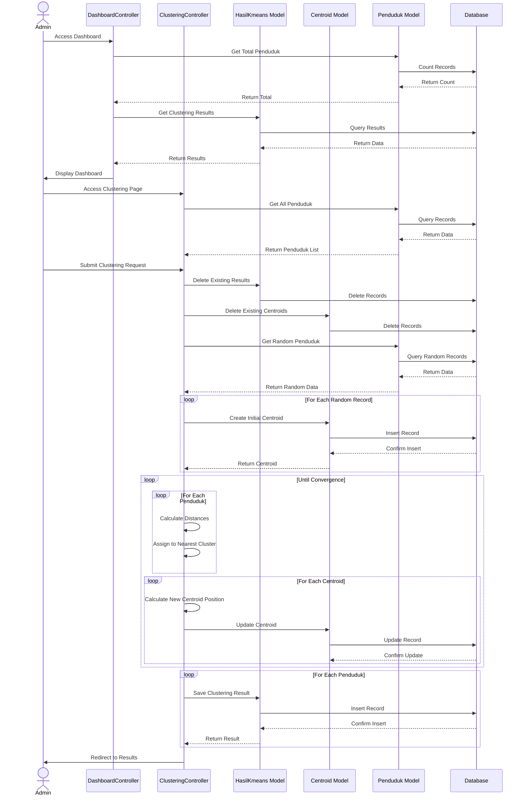

# Sequence Diagram - K-means Clustering Process

## Description

This sequence diagram illustrates the flow of the K-means clustering process in the application:

1. **Dashboard Access**
   - Admin accesses the dashboard
   - System retrieves total penduduk count
   - System retrieves clustering results
   - Dashboard displays statistics and charts

2. **Clustering Process**
   - Admin accesses clustering page
   - System retrieves all penduduk data
   - Admin initiates clustering process
   - System clears existing results and centroids
   - System creates initial centroids from random penduduk
   - System performs clustering iterations until convergence
   - System saves final clustering results

3. **Key Components**
   - DashboardController: Handles dashboard display
   - ClusteringController: Manages clustering process
   - HasilKmeans Model: Stores clustering results
   - Centroid Model: Manages cluster centroids
   - Penduduk Model: Contains penduduk data

4. **Process Flow**
   - Data preparation
   - Initial centroid selection
   - Iterative clustering
   - Result storage
   - Dashboard update 